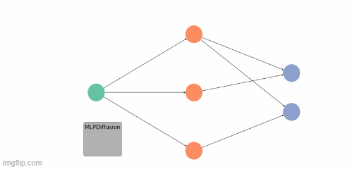

Leveraging Graph Neural Networks for Relational Data Synthesis
==============================
<p align="center">
  
</p>

Relational data synthesis is an emerging field in both research and industry. Its primary objective is
to develop methods that allow for the creation of databases that preserve the inherent characteristics
of the original data while also ensuring privacy protection. The synthesis of single-table tabular
datasets has made significant advances in recent years. However, the more intricate challenge of
synthesising entire databases has received less attention. A primary limitation of these methods is
their struggle to preserve the relationships between different tables within the database.

In this project we explicitly model the relationships between tables by leveraging a graph representation of the data.

Installation
------------
Create environment and install requirements
```bash
conda create -n mlg python=3.10
conda activate mlg
pip install -r requirements.txt
```
Install PyTorch and PyTorch Geometric dependencies

```bash
pip install torch torchvision torchaudio --index-url https://download.pytorch.org/whl/cu121 
pip install torch-sparse -f https://pytorch-geometric.com/whl/torch-2.1.0+cu121.html
pip install torch-scatter -f https://pytorch-geometric.com/whl/torch-2.1.0+cu121.html
```

Project Organization
------------

    ├── LICENSE
    ├── README.md          <- The top-level README for developers using this project.
    ├── ckpt               <- Directory containing VAE and diffusion checkpoints.
    ├── data               <- Directory containing the data used in the project.
    ├── eval               <- Directory containing the evaluation results.
    ├── models             <- Directory containing the GNN model weights.
    ├── notebooks          <- Jupyter notebooks.
    ├── requirements.txt   <- The requirements file for reproducing the environment
    ├── setup.py           <- makes project pip installable (pip install -e .) so src can be imported
    ├── src                <- Source code for use in this project.
    ├── tabsyn             <- Modified tabsyn submodule code.
<!--     
│   ├── __init__.py    <- Makes src a Python module
    │   │
    │   ├── data           <- Scripts to download or generate data
    │   │   └── make_dataset.py
    │   │
    │   ├── features       <- Scripts to turn raw data into features for modeling
    │   │   └── build_features.py
    │   │
    │   ├── models         <- Scripts to train models and then use trained models to make
    │   │   │                 predictions
    │   │   ├── predict_model.py
    │   │   └── train_model.py
    │   │
    │   └── visualization  <- Scripts to create exploratory and results oriented visualizations
    │       └── visualize.py
    │
    └── tox.ini            <- tox file with settings for running tox; see tox.readthedocs.io -->


--------

<p><small>Project based on the <a target="_blank" href="https://drivendata.github.io/cookiecutter-data-science/">cookiecutter data science project template</a>. #cookiecutterdatascience</small></p>
